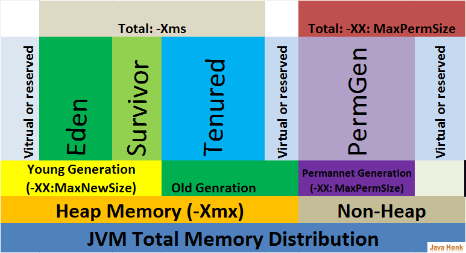

# Troubleshooting-Performance

Projeto com o ecossistema necessário para otimização de JVM e detecção de problemas de performance.

O foco é aplicações que utilizem JVM Hotspot.

## Montando ambiente

Pré-requisitos:

1. Instalação do Docker
2. Instalação Docker Compose
3. Instalação K6

Como rodar?

```sh
docker-compose up
```

### Services and port numbers

| Service     | Port Number | Type/Tech       |
| ----------- | ----------- | --------------- |
| Mysql       | 3306        | DB              |
| Application | 8080/9090   | Spring boot Rest / gRPC     |
| Proxy-gRPC | 8081   | Spring boot Rest     |
| Prometheus  | 9091        | DB              |
| Grafana     | 3030        | Metrics Monitor |

#### Urls

| Endpoints     | URL |
| ----------- | ----------- |
| Application       | <http://localhost:8080/stock-quotes> |
| Application - Metrics       | <http://localhost:8080/actuator/prometheus> |
| Application - ThreadDump       | <http://localhost:8080/actuator/threaddump> |
| Application - HeapDump       | <http://localhost:8080/actuator/heapdump> |
| Proxy-gRPC       | <http://localhost:8081/proxy-stock-quotes> |
| Prometheus       | <http://localhost:9091> |
| Grafana       | <http://localhost:3000> |

## ToolKit performance

### SO

#### CPU

```
top

  %MEM  --  Memory usage (RES)
      A task's currently used share of available physical memory.

   VIRT  --  Virtual Image (kb)
      The  total  amount  of  virtual  memory  used  by the task.  It
      includes all code, data and shared libraries  plus  pages  that
      have  been  swapped out and pages that have been mapped but not
      used.

   SWAP  --  Swapped size (kb)
      Memory that is not resident but is present in a task.  This  is
      memory  that  has been swapped out but could include additional
      non-resident memory.  This column is calculated by  subtracting
      physical memory from virtual memory.

   RES  --  Resident size (kb)
      The non-swapped physical memory a task has used.

```

```
htop

-C --no-color                   Use a monochrome color scheme
-d --delay=DELAY                Set the delay between updates, in tenths of seconds
-F --filter=FILTER              Show only the commands matching the given filter
-h --help                       Print this help screen
-H --highlight-changes[=DELAY]  Highlight new and old processes
-M --no-mouse                   Disable the mouse
-p --pid=PID[,PID,PID...]       Show only the given PIDs
-s --sort-key=COLUMN            Sort by COLUMN in list view (try --sort-key=help for a list)
-t --tree                       Show the tree view (can be combined with -s)
-u --user[=USERNAME]            Show only processes for a given user (or $USER)
-U --no-unicode                 Do not use unicode but plain ASCII
-V --version                    Print version info

Long options may be passed with a single dash.

```

#### Memória

```sh
free

Usage:
 free [options]

Options:
 -b, --bytes         show output in bytes
     --kilo          show output in kilobytes
     --mega          show output in megabytes
     --giga          show output in gigabytes
     --tera          show output in terabytes
     --peta          show output in petabytes
 -k, --kibi          show output in kibibytes
 -m, --mebi          show output in mebibytes
 -g, --gibi          show output in gibibytes
     --tebi          show output in tebibytes
     --pebi          show output in pebibytes
 -h, --human         show human-readable output
     --si            use powers of 1000 not 1024
 -l, --lohi          show detailed low and high memory statistics
 -t, --total         show total for RAM + swap
 -s N, --seconds N   repeat printing every N seconds
 -c N, --count N     repeat printing N times, then exit
 -w, --wide          wide output

     --help     display this help and exit
 -V, --version  output version information and exit
```

### Java

```sh
jcmd

Printa as informações básicas de classe, threads, JVM para o processo Java.

Usage: jcmd <pid | main class> <command ...|PerfCounter.print|-f file>
   or: jcmd -l                                                    
   or: jcmd -h                                                    
                                                                  
  command must be a valid jcmd command for the selected jvm.      
  Use the command "help" to see which commands are available.   
  If the pid is 0, commands will be sent to all Java processes.   
  The main class argument will be used to match (either partially 
  or fully) the class used to start Java.                         
  If no options are given, lists Java processes (same as -l).     
                                                                  
  PerfCounter.print display the counters exposed by this process  
  -f  read and execute commands from the file                     
  -l  list JVM processes on the local machine                     
  -? -h --help print this help message                            
(base) marcelo@marcelo-A72-LIV:~/Docum
```

```sh
jconsole

Gui com as atividades da JVM.
```

```sh
jmap

Provê um heapdump a outras informações sobre a utilização de memória da JVM.

Usage:
    jmap -clstats <pid>
        to connect to running process and print class loader statistics
    jmap -finalizerinfo <pid>
        to connect to running process and print information on objects awaiting finalization
    jmap -histo[:live] <pid>
        to connect to running process and print histogram of java object heap
        if the "live" suboption is specified, only count live objects
    jmap -dump:<dump-options> <pid>
        to connect to running process and dump java heap
    jmap -? -h --help
        to print this help message

    dump-options:
      live         dump only live objects; if not specified,
                   all objects in the heap are dumped.
      format=b     binary format
      file=<file>  dump heap to <file>

    Example: jmap -dump:live,format=b,file=heap.bin <pid>
```

```sh
jinfo

Provê as informações das propriedades da JVM.

Usage:
    jinfo <option> <pid>
       (to connect to a running process)

where <option> is one of:
    -flag <name>         to print the value of the named VM flag
    -flag [+|-]<name>    to enable or disable the named VM flag
    -flag <name>=<value> to set the named VM flag to the given value
    -flags               to print VM flags
    -sysprops            to print Java system properties
    <no option>          to print both VM flags and system properties
    -? | -h | --help | -help to print this help message
```

```sh
jstack

Provê as informações das propriedades da JVM.

Usage:
    jstack [-l][-e] <pid>
        (to connect to running process)

Options:
    -l  long listing. Prints additional information about locks
    -e  extended listing. Prints additional information about threads
    -? -h --help -help to print this help message
```

```sh
jstat

Provê as informações sobre GC e class-loading.

Usage: jstat --help|-options
       jstat -<option> [-t] [-h<lines>] <vmid> [<interval> [<count>]]

Definitions:
  <option>      An option reported by the -options option
  <vmid>        Virtual Machine Identifier. A vmid takes the following form:
                     <lvmid>[@<hostname>[:<port>]]
                Where <lvmid> is the local vm identifier for the target
                Java virtual machine, typically a process id; <hostname> is
                the name of the host running the target Java virtual machine;
                and <port> is the port number for the rmiregistry on the
                target host. See the jvmstat documentation for a more complete
                description of the Virtual Machine Identifier.
  <lines>       Number of samples between header lines.
  <interval>    Sampling interval. The following forms are allowed:
                    <n>["ms"|"s"]
                Where <n> is an integer and the suffix specifies the units as 
                milliseconds("ms") or seconds("s"). The default units are "ms".
  <count>       Number of samples to take before terminating.
  -J<flag>      Pass <flag> directly to the runtime system.
  -? -h --help  Prints this help message.
  -help         Prints this help message.

```

#### Exemplos

Informações de JVM

```sh
# Lista todos os processos Java
jcmd
# Informações das flags de tunning
jcmd <process id> VM.flags
# Todos os valores flag
jinfo --flags <process id>
```

Threads

```sh
# Lista a stack das threads
jstack <process id>
jcmd <process id> Thread.print
```

### Tunning

#### JIT Compiler

Ao compilarmos uma classe utilizando o comando **javac**, o compilador irá gerar uma representação binária chamada bytecode. Esse arquivo é interpretado pela JVM, que por sua vez traduz para linguagem de máquina. Esse processo de interpretação acaba onerando a performance justamente por ter esse processo intermediário.

O Compilador JIT, possui um algoritmo que identifica métodos chamados frequentemente e compila para linguagem de máquina.

Essa primeira versão compilada para linguagem de máquina é chamada **C1**. Ao observar que o método continua sendo chamado frequentemente, ele irá compilar o código em uma versão mais otimizada chamada de **C2**. Esse processo é chamado de **Tiered Compilation**

#### Codecache

Quando a JVM compila, ele armazena esse assembly no code cache. Caso esse espaço de memória esteja cheio, a JVM não vai mais compilar o código.

Como chegar em um valor otimizado?

Rode a aplicação com a flag **-XX:+PrintCodeCache** e observe o valor máximo.

Com os valores, configure as seguintes flags:

```sh
-XX:initialCodeCacheSize=N
-XX:ReservedCodeCacheSize=N
```

#### Garbage Collection

Garbage Collection é o processo de limpar a memória através do descarte de objetos que não são mais utilizados.
Quando os objetos são descartados, a JVM também efetua a compactação da mamória para evitar a fragmentação.


##### Gerações GC

O Garbage Collector trabalha quebrando a heap em gerações. As gerações são chamadas **old (ternure)** e **young**. A **young** possui dois espaços de memória chamados de **eden** e **survivor**.



Eden: Objeto é armazenado quando ocorre o new.
Survivor. A operação que efetua a limpeza desses objetos é chamada de **Minor GC** ou **Young GC**.

Survivor Space: Objetos que não são descartados no minor GC, são movidos para o espaço Survivor. Alguns algoritmos param todas as threads para encontrar os objetos que não são mais utilizados. Esse processo é chamado de **Full GC**.

Old Generation: Também conhecida como Ternure, contém os objetos que sobreviveram após o GC da Young Generation. Esse processo ocore em ciclos maiores.

Metaspace Generation: Contém os metadados de estruturas estáticas e informações de tipos primitivos.

Observação:

Algoritmos com coletores concorrentes como o G1GC analisam os objetos sem parar as threads.

Tradeoff:

1. Se possui CPU suficiente, utilize os algoritmos concorrentes.
2. Se a CPU é limitada, a utilização de coletores concorrentes causará uma maior concorrência entre as threads do GC e as thrads aumentará o tempo de resposta, pois as threads do GC concorrerão com a CPU das threads da aplicação. Utilize portanto o **SerialGC**.

Todos os algoritmos paralelos utilizam multiplas threads. A quantidade de threads utilizada pode ser configurada com a flag:

```sh
-XX:ParallelGCThreads=N
```

Onde o N é obtido através da fórmula:

```sh
N = 8 + ((QTD_CPUs - 8) * 5 / 8)
```

##### GC Logs

```sh
-Xlog:gc*:file=gc.log:time:filecount=7,filesize=8M
```
