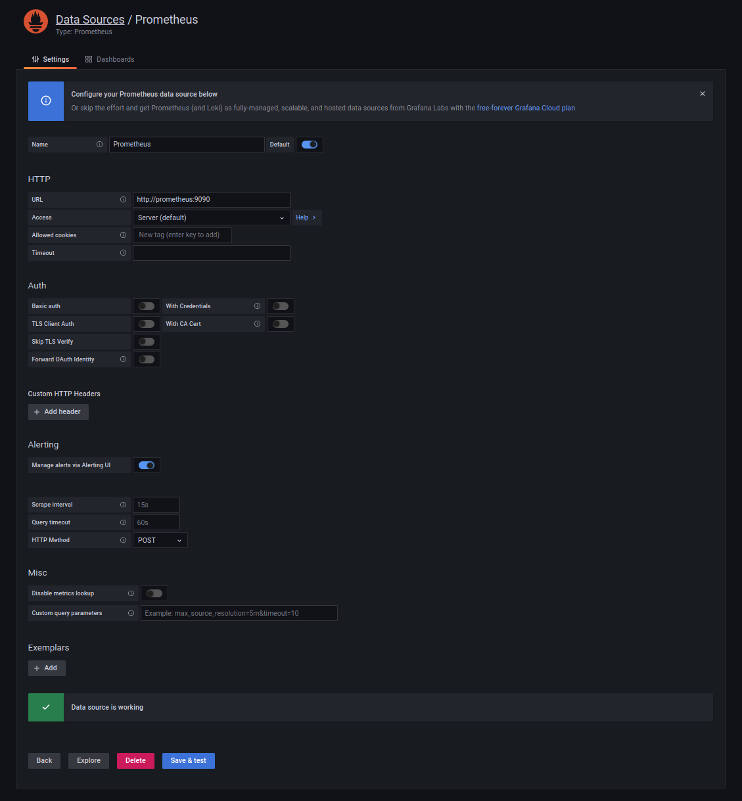
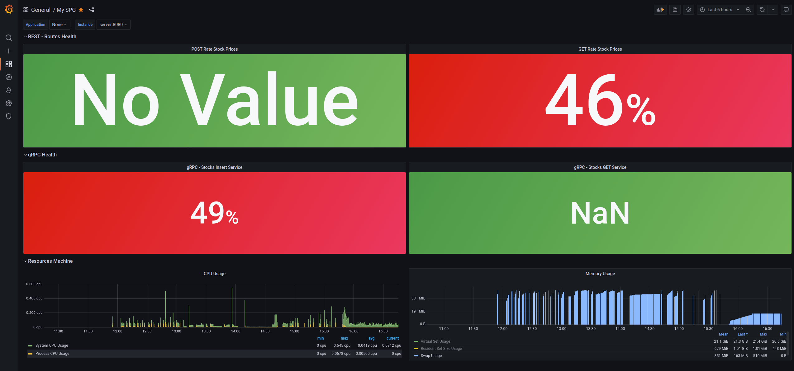
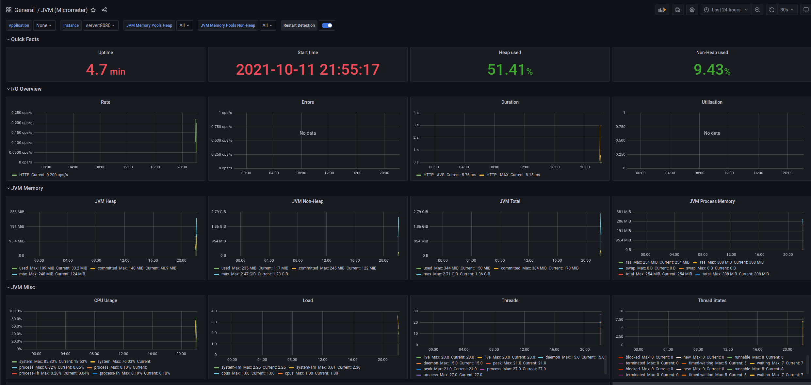
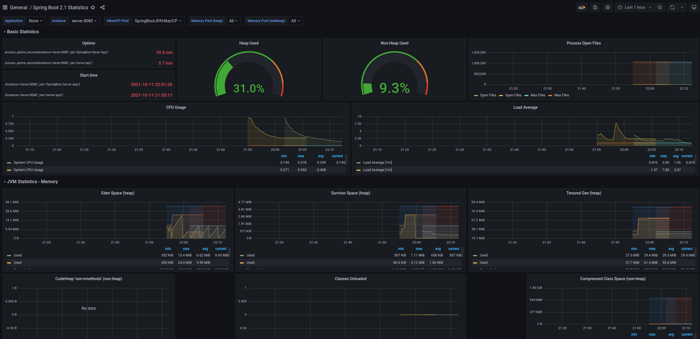
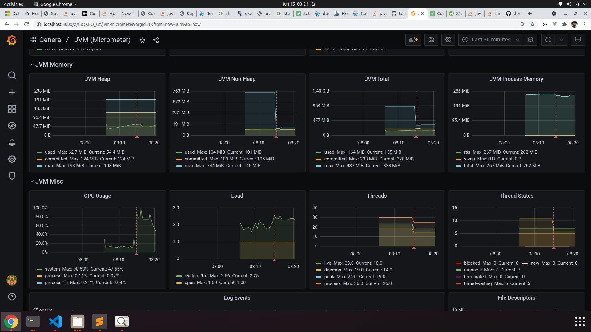

# Troubleshooting-Performance

This project provides a complete ecosystem for throubleshootings with spring-boot, rest/grpc, hibernate and ehcache application.

You can change de hyperparameters like jvm or minmalloc/jemalloc configs and measure the metrics.

To generate requests, change the [K6](https://k6.io/)/Jmeter scripts with yours configs like RPS, and thresholds.

## Starting Analysis

1. Enable actuator metrics on **application.properties** (Already configured):

   ```sh
   management.endpoints.web.exposure.include=*
   ```

1. Into **Dockerfile** comment or discomment memory allocations configs and jvm parameters

1. Start Docker environment:

   ```sh
   make.sh
   ```

   This step will build projects and start environment with docker-compose.

2. Start K8S environment (IN PROGRESS):

   ```sh
   configure-k8s.sh
   ```

1. Run the [K6](https://k6.io/) scripts

   Run performance test using gRPC protocol

   ```sh
   k6 run k6-post-grpc-script.js
   ```

   Run performance test using rest

   ```sh
   k6 run k6-post-rest-script.js
   ```

   Run consumer rest calling gRPC server. This tests the keep alive configs from server and client

   ```sh
   k6 run k6-post-proxy-grpc-script.js
   ```

1. You can take snapshots of threaddump with this command:

   ```sh
   sh generate_threaddump.sh
   ```

1. Alternate JVM parameters to see differences of resources:

```sh
   #Java Heap
   -Xms500m # Initial java heap
   -Xmx500m # Max java heap
   -Xss1m # Thread memory allocation
   -XX:+UseContainerSupport # Enable container suports for jvm <= 8
   -XX:InitiatingHeapOccupancyPercent=70 # Alternative for fixed -Xms
   -XX:MaxRAMPercentage=50 # Alternative for fixed -Xmx
   #Non Heap
   -Djdk.nio.maxCachedBufferSize=1000000 # Limit buffer cache used into NIO
   -XX:MaxDirectMemorySize=128m
   -XX:CompressedClassSpaceSize=64m
   -XX:MaxMetaspaceSize=128m
   -XX:+UseStringDeduplication
   # GC
   -XX:+UseG1GC
   -XX:MaxGCPauseMillis=200
   -XX:ConcGCThreads=5
   -XX:ParallelGCThreads=20
   -Xloggc:./gc.log
   -XX:+PrintGCDetails
   -XX:+PrintGCDateStamps
   -XX:+PrintGCTimeStamps
   # Monitoring
   -XX:NativeMemoryTracking=summary
   -XX:+UnlockCommercialFeatures
   -XX:+FlightRecorder
   -XX:StartFlightRecording=duration=60s,filename=profiling.jfr
```

### Services and port numbers

| Service     | Port Number | Type/Tech       |
| ----------- | ----------- | --------------- |
| Mysql       | 3306        | DB              |
| Application | 8080/9090   | Spring boot Rest / gRPC     |
| Proxy-gRPC | 8081   | Spring boot Rest     |
| Prometheus  | 9091        | DB              |
| Grafana     | 3030        | Metrics Monitor |

#### Urls

| Endpoints     | URL |
| ----------- | ----------- |
| Application       | http://localhost:8080/stock-quotes |
| Application - Metrics       | http://localhost:8080/actuator/prometheus |
| Application - ThreadDump       | http://localhost:8080/actuator/threaddump |
| Application - HeapDump       | http://localhost:8080/actuator/heapdump |
| Proxy-gRPC       | http://localhost:8081/proxy-stock-quotes |
| Prometheus       | http://localhost:9091 |
| Grafana       | http://localhost:3000 |

## Grafana

**First login:**

   user: **admin**

   password: **admin**

### Configure Datasource

Configure the datasource using docker-compose service dns and port(**prometheus:9090**)



**Useful Dashboards:**

   1. Single Pane of Glass (grafana/custom-dash-spg.json)

   2. Micrometer - https://grafana.com/grafana/dashboards/4701

   3. Spring boot - https://grafana.com/grafana/dashboards/10280


## Datascience and Analytics

Into **analytics** directory follow instructions of [Readme.md](https://github.com/ortisan/troubleshooting-performance/tree/main/analytics/README.md).

## Tests

Decreasing Tomcat and Hikari thread pool size:



## Useful links

- [JMC tool](https://www.oracle.com/webapps/redirect/signon?nexturl=https://download.oracle.com/otn-pub/java/jmc/7.1.2%2B04/a4634525489241b9a9e1aa73d9e118e6/jmc-7.1.2_linux-x64.tar.gz)

- [GC explained](https://sematext.com/blog/java-garbage-collection/)

      Important:

      Actually, any object larger than 50% of the region size is considered humongous. Those objects are not allocated in the
      young generation space, but instead, they are put directly in the Tenured generation. Such objects can increase the
      pause time of the garbage collector and can increase the risk of triggering the Full GC because of running out of
      continued free space.

- [JVM Footprint 1](https://stackoverflow.com/questions/53451103/java-using-much-more-memory-than-heap-size-or-size-correctly-docker-memory-limi/53624438#53624438)

- [JVM Footprint 2](https://www.youtube.com/watch?v=c755fFv1Rnk)

- [Improving Performance and Footprint](https://medium.com/@jean_sossmeier/spring-boot-jvm-1eea422be930)

- [Troubleshooting Problems With Native (Off-Heap) Memory in Java Application](https://dzone.com/articles/troubleshooting-problems-with-native-off-heap-memo)


## Useful Commands

- Show jvm params:

   ```sh
   java -XX:+PrintFlagsFinal -version | grep CodeCacheFlush
   ```

- Native memory:

   See RES (Resident Set Size) of process:

   ```sh
   top
   ```

- JCMD:

   ```sh
   jcmd <PID> VM.native_memory
   ```

- Memory Map:

   ```sh
   pmap -xx <PID>
   ```
